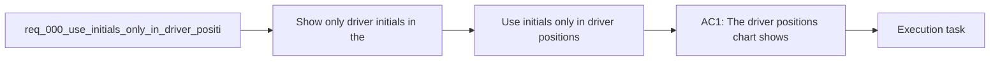

## item_000_use_initials_only_in_driver_positions_chart - Use initials only in driver positions chart
> From version: 0.1.0
> Status: Ready
> Understanding: 100%
> Confidence: 95%
> Progress: 0%
> Complexity: Low
> Theme: UI
> Reminder: Update status/understanding/confidence/progress and linked task references when you edit this doc.

# Problem
- Show only driver initials in the driver positions chart.
- Avoid displaying full surnames or longer end labels on the chart itself.
- Keep the chart readable in normal page mode, not only in fullscreen.
- The current end labels are visually heavy and reduce readability when many drivers are visible.

# Scope
- In:
- Update the driver positions chart so on-chart line labels use driver initials only.
- Preserve existing legend, tooltip, filtering, and fullscreen behaviors.
- Keep the chart readable in standard page view when multiple drivers are visible.
- Out:
- Do not rename drivers in unrelated charts, tables, or navigation.
- Do not redesign the chart beyond the label format change needed for readability.

# Acceptance criteria
- AC1: The driver positions chart shows initials only for driver line labels rendered on the chart.
- AC2: Full names remain available where appropriate outside the chart, such as tooltips or other panels, if already present.
- AC3: The chart remains readable in non-fullscreen mode with multiple visible drivers.
- AC4: Driver filtering and fullscreen mode still behave the same after the label change.

# AC Traceability
- AC1 -> Scope: The driver positions chart shows initials only for driver line labels rendered on the chart.. Proof: TODO.
- AC2 -> Scope: Full names remain available where appropriate outside the chart, such as tooltips or other panels, if already present.. Proof: TODO.
- AC3 -> Scope: The chart remains readable in non-fullscreen mode with multiple visible drivers.. Proof: TODO.
- AC4 -> Scope: Driver filtering and fullscreen mode still behave the same after the label change.. Proof: TODO.

# Decision framing
- Product framing: Consider
- Product signals: navigation and discoverability
- Product follow-up: Review whether a product brief is needed before scope becomes harder to change.
- Architecture framing: Not needed
- Architecture signals: (none detected)
- Architecture follow-up: No architecture decision follow-up is expected based on current signals.

# Links
- Product brief(s): (none yet)
- Architecture decision(s): (none yet)
- Request: `req_000_use_initials_only_in_driver_positions_chart`
- Primary task(s): `task_000_use_initials_only_in_driver_positions_chart`

# References
- `logics/skills/logics-ui-steering/SKILL.md`

# Priority
- Impact: Medium
- Urgency: Low

# Notes
- Derived from request `req_000_use_initials_only_in_driver_positions_chart`.
- Source file: `logics\request\req_000_use_initials_only_in_driver_positions_chart.md`.
- Request context seeded into this backlog item from `logics\request\req_000_use_initials_only_in_driver_positions_chart.md`.
