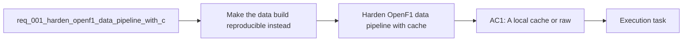

## item_001_harden_openf1_data_pipeline_with_cache_and_validation - Harden OpenF1 data pipeline with cache and validation
> From version: 0.1.0
> Status: Done
> Understanding: 95%
> Confidence: 90%
> Progress: 100%
> Complexity: Medium
> Theme: Data
> Reminder: Update status/understanding/confidence/progress and linked task references when you edit this doc.

# Problem
- Make the data build reproducible instead of depending entirely on live OpenF1 responses at build time.
- Add a local cache or raw snapshot layer so previously fetched sessions can be rebuilt without hitting the API again.
- Add automated validation for generated analytics datasets so inferred metrics regressions are caught before delivery.
- Document a supported Windows-friendly workflow for local development and data refresh.
- The project is a static analytics site, so build-time data quality is the core product dependency.
- `scripts/build-data.mjs` is the main integration point for OpenF1 source data and derived analytics generation.

# Scope
- In:
- Persist OpenF1 source responses locally during data builds.
- Support a cache-only rebuild path for already fetched sessions.
- Add dataset validation for generated Grand Prix and Sprint JSON payloads.
- Update local developer documentation for PowerShell and cache-aware workflows.
- Out:
- Replacing OpenF1 as a source provider.
- Adding a runtime backend.
- Redesigning the analytics UI.

# Acceptance criteria
- AC1: A local cache or raw snapshot layer exists for OpenF1 source data used by `scripts/build-data.mjs`.
- AC2: The project can rebuild existing cached sessions without requiring a live OpenF1 call for every endpoint.
- AC3: At least one automated validation command checks generated dataset integrity for core analytics fields and fails loudly on missing or invalid required structures.
- AC4: The validation scope explicitly covers a representative Grand Prix session and a representative Sprint session.
- AC5: The local developer documentation includes a supported Windows-friendly command path for install, UI-only work, and full data refresh.

# AC Traceability
- AC1 -> Scope: A local cache or raw snapshot layer exists for OpenF1 source data used by `scripts/build-data.mjs`. Proof: `.cache/openf1/` populated by `npm.cmd run build:data`.
- AC2 -> Scope: The project can rebuild existing cached sessions without requiring a live OpenF1 call for every endpoint. Proof: `npm.cmd run build:data:cached` succeeded.
- AC3 -> Scope: At least one automated validation command checks generated dataset integrity for core analytics fields and fails loudly on missing or invalid required structures. Proof: `npm.cmd run validate:data`.
- AC4 -> Scope: The validation scope explicitly covers a representative Grand Prix session and a representative Sprint session. Proof: validator checks one `grand-prix` and one `sprint` payload from `public/data/index.json`.
- AC5 -> Scope: The local developer documentation includes a supported Windows-friendly command path for install, UI-only work, and full data refresh. Proof: `README.md` PowerShell section now uses `npm.cmd`.

# Decision framing
- Product framing: Not needed
- Product signals: (none detected)
- Product follow-up: No product brief follow-up is expected based on current signals.
- Architecture framing: Required
- Architecture signals: data model and persistence, contracts and integration, state and sync
- Architecture follow-up: Create or link an architecture decision before irreversible implementation work starts.

# Links
- Product brief(s): (none yet)
- Architecture decision(s): `adr_000_openf1_cache_and_dataset_validation`
- Request: `req_001_harden_openf1_data_pipeline_with_cache_and_validation`
- Primary task(s): `task_001_harden_openf1_data_pipeline_with_cache_and_validation`

# References
- `scripts/build-data.mjs`
- `scripts/validate-data.mjs`
- `README.md`

# Priority
- Impact: High
- Urgency: Medium

# Notes
- Derived from request `req_001_harden_openf1_data_pipeline_with_cache_and_validation`.
- Source file: `logics\request\req_001_harden_openf1_data_pipeline_with_cache_and_validation.md`.
- Request context seeded into this backlog item from `logics\request\req_001_harden_openf1_data_pipeline_with_cache_and_validation.md`.
