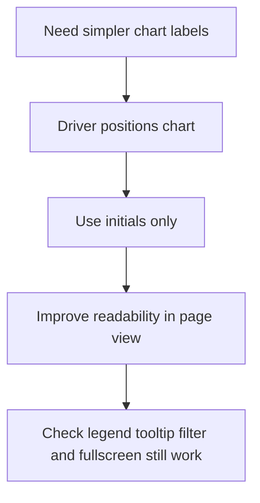

## req_000_use_initials_only_in_driver_positions_chart - Use initials only in driver positions chart
> From version: 0.1.0
> Status: Draft
> Understanding: 100%
> Confidence: 95%
> Complexity: Low
> Theme: UI
> Reminder: Update status/understanding/confidence and references when you edit this doc.

# Needs
- Show only driver initials in the driver positions chart.
- Avoid displaying full surnames or longer end labels on the chart itself.
- Keep the chart readable in normal page mode, not only in fullscreen.

# Context
- The current driver positions chart uses end labels that can become visually heavy.
- For this specific chart, the requested UX is simpler: show initials only so the focus stays on position changes over the session.
- The change should apply to the driver positions chart without degrading legend, tooltip, filtering, or fullscreen behavior.
- The site is static and chart rendering is handled in the frontend with Chart.js.

# Acceptance criteria
- AC1: The driver positions chart shows initials only for driver line labels rendered on the chart.
- AC2: Full names remain available where appropriate outside the chart, such as tooltips or other panels, if already present.
- AC3: The chart remains readable in non-fullscreen mode with multiple visible drivers.
- AC4: Driver filtering and fullscreen mode still behave the same after the label change.

# Definition of Ready (DoR)
- [x] Problem statement is explicit and user impact is clear.
- [x] Scope boundaries (in/out) are explicit.
- [x] Acceptance criteria are testable.
- [x] Dependencies and known risks are listed.

# Companion docs
- Product brief(s): (none yet)
- Architecture decision(s): (none yet)

# Backlog
- `item_000_use_initials_only_in_driver_positions_chart`
