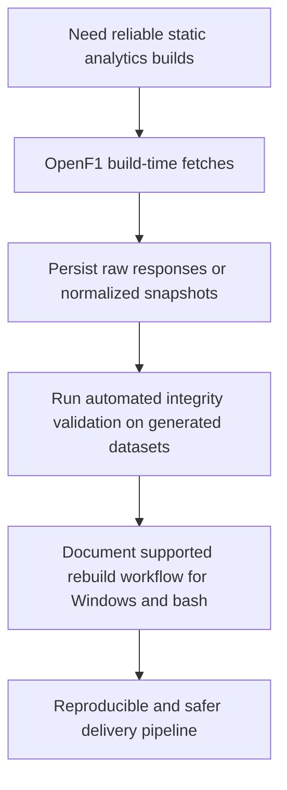

## req_001_harden_openf1_data_pipeline_with_cache_and_validation - Harden OpenF1 data pipeline with cache and validation
> From version: 0.1.0
> Status: Done
> Understanding: 95%
> Confidence: 90%
> Complexity: Medium
> Theme: Data
> Reminder: Update status/understanding/confidence and references when you edit this doc.

# Needs
- Make the data build reproducible instead of depending entirely on live OpenF1 responses at build time.
- Add a local cache or raw snapshot layer so previously fetched sessions can be rebuilt without hitting the API again.
- Add automated validation for generated analytics datasets so inferred metrics regressions are caught before delivery.
- Document a supported Windows-friendly workflow for local development and data refresh.

# Context
- The project is a static analytics site, so build-time data quality is the core product dependency.
- `scripts/build-data.mjs` currently fetches OpenF1 directly for sessions, drivers, laps, positions, intervals, stints, pit data, race control, and weather during every rebuild.
- The build has retry logic, but no persisted cache, no raw source snapshot, and no deterministic rebuild path when the upstream API is slow, rate-limited, or changes shape.
- `package.json` currently exposes build and dev commands only; there is no dedicated validation or test command for dataset integrity.
- The generated analytics include several inferred metrics, so silent regressions are possible even when the UI still builds.
- The repository should remain static at runtime; any hardening must stay in the pre-build pipeline and local tooling.

# Acceptance criteria
- AC1: A local cache or raw snapshot layer exists for OpenF1 source data used by `scripts/build-data.mjs`.
- AC2: The project can rebuild existing cached sessions without requiring a live OpenF1 call for every endpoint.
- AC3: At least one automated validation command checks generated dataset integrity for core analytics fields and fails loudly on missing or invalid required structures.
- AC4: The validation scope explicitly covers a representative Grand Prix session and a representative Sprint session.
- AC5: The local developer documentation includes a supported Windows-friendly command path for install, UI-only work, and full data refresh.

# Definition of Ready (DoR)
- [x] Problem statement is explicit and user impact is clear.
- [x] Scope boundaries (in/out) are explicit.
- [x] Acceptance criteria are testable.
- [x] Dependencies and known risks are listed.

# Companion docs
- Product brief(s): (none yet)
- Architecture decision(s): `adr_000_openf1_cache_and_dataset_validation`

# Scope notes
- In scope:
- Build-time cache or snapshot persistence for OpenF1 source inputs.
- Dataset validation for generated static JSON and key inferred metrics.
- Developer workflow documentation for supported local commands.
- Out of scope:
- Replacing OpenF1 as the upstream source.
- Adding a runtime backend or server-side API.
- Redesigning the analytics UI.

# Backlog
- `item_001_harden_openf1_data_pipeline_with_cache_and_validation`
