## task_000_use_initials_only_in_driver_positions_chart - Use initials only in driver positions chart
> From version: 0.1.0
> Status: Ready
> Understanding: 100%
> Confidence: 95%
> Progress: 0%
> Complexity: Low
> Theme: UI
> Reminder: Update status/understanding/confidence/progress and dependencies/references when you edit this doc.

# Context
- Derived from backlog item `item_000_use_initials_only_in_driver_positions_chart`.
- Source file: `logics\backlog\item_000_use_initials_only_in_driver_positions_chart.md`.
- Related request(s): `req_000_use_initials_only_in_driver_positions_chart`.
- Show only driver initials in the driver positions chart.
- Avoid displaying full surnames or longer end labels on the chart itself.
- Keep the chart readable in normal page mode, not only in fullscreen.
- The likely implementation surface is the driver positions chart rendering in `src/lib/charts.js`, with any supporting label formatting in `src/pages/session.js` if needed.

```mermaid
%% logics-kind: task
%% logics-signature: task|use-initials-only-in-driver-positions-ch|item-000-use-initials-only-in-driver-pos|1-confirm-scope-dependencies-and-linked|run-the-relevant-automated-tests-for
flowchart LR
    Backlog[item_000_use_initials_only_in_driver_posit] --> Step1[1. Confirm scope dependencies and linked]
    Step1 --> Step2[2. Implement the scoped changes from]
    Step2 --> Step3[3. Validate the result and update]
    Step3 --> Validation[Run the relevant automated tests for]
    Validation --> Report[Done report]
```

# Plan
- [ ] 1. Confirm how the driver positions chart currently builds visible driver labels and where full names are injected.
- [ ] 2. Update the chart so only driver initials are rendered on-chart while preserving tooltip, legend, filtering, and fullscreen behavior.
- [ ] 3. Validate the rendering in standard page view and update the linked Logics docs with evidence.
- [ ] FINAL: Update related Logics docs

# AC Traceability
- AC1 -> Scope: The driver positions chart shows initials only for driver line labels rendered on the chart.. Proof: TODO.
- AC2 -> Scope: Full names remain available where appropriate outside the chart, such as tooltips or other panels, if already present.. Proof: TODO.
- AC3 -> Scope: The chart remains readable in non-fullscreen mode with multiple visible drivers.. Proof: TODO.
- AC4 -> Scope: Driver filtering and fullscreen mode still behave the same after the label change.. Proof: TODO.

# Decision framing
- Product framing: Consider
- Product signals: navigation and discoverability
- Product follow-up: Review whether a product brief is needed before scope becomes harder to change.
- Architecture framing: Not needed
- Architecture signals: (none detected)
- Architecture follow-up: No architecture decision follow-up is expected based on current signals.

# Links
- Product brief(s): (none yet)
- Architecture decision(s): (none yet)
- Backlog item: `item_000_use_initials_only_in_driver_positions_chart`
- Request(s): `req_000_use_initials_only_in_driver_positions_chart`

# References
- `logics/skills/logics-ui-steering/SKILL.md`

# Validation
- Run `npm.cmd run build:ui` to confirm the static UI still builds.
- Verify the driver positions chart in normal page view and fullscreen view uses initials only on-chart.
- Verify tooltips, legend interactions, and global driver filtering still behave the same.

# Definition of Done (DoD)
- [ ] Scope implemented and acceptance criteria covered.
- [ ] Validation commands executed and results captured.
- [ ] Linked request/backlog/task docs updated.
- [ ] Status is `Done` and progress is `100%`.

# Report
