## task_001_harden_openf1_data_pipeline_with_cache_and_validation - Harden OpenF1 data pipeline with cache and validation
> From version: 0.1.0
> Status: Done
> Understanding: 95%
> Confidence: 90%
> Progress: 100%
> Complexity: Medium
> Theme: Data
> Reminder: Update status/understanding/confidence/progress and dependencies/references when you edit this doc.

# Context
- Derived from backlog item `item_001_harden_openf1_data_pipeline_with_cache_and_validation`.
- Source file: `logics\backlog\item_001_harden_openf1_data_pipeline_with_cache_and_validation.md`.
- Related request(s): `req_001_harden_openf1_data_pipeline_with_cache_and_validation`.
- Make the data build reproducible instead of depending entirely on live OpenF1 responses at build time.
- Add a local cache or raw snapshot layer so previously fetched sessions can be rebuilt without hitting the API again.
- Add automated validation for generated analytics datasets so inferred metrics regressions are caught before delivery.
- Add a Windows-friendly workflow for install, UI work, and full data refresh.

```mermaid
%% logics-kind: task
%% logics-signature: task|harden-openf1-data-pipeline-with-cache-a|item-001-harden-openf1-data-pipeline-wit|1-confirm-scope-dependencies-and-linked|run-the-relevant-automated-tests-for
flowchart LR
    Backlog[item_001_harden_openf1_data_pipeline_with_] --> Step1[1. Confirm scope dependencies and linked]
    Step1 --> Step2[2. Implement the scoped changes from]
    Step2 --> Step3[3. Validate the result and update]
    Step3 --> Validation[Run the relevant automated tests for]
    Validation --> Report[Done report]
```

# Plan
- [x] 1. Confirm scope, dependencies, and linked acceptance criteria.
- [x] 2. Implement the scoped changes from the backlog item.
- [x] 3. Validate the result and update the linked Logics docs.
- [x] FINAL: Update related Logics docs

# AC Traceability
- AC1 -> Scope: A local cache or raw snapshot layer exists for OpenF1 source data used by `scripts/build-data.mjs`. Proof: request-response cache stored under `.cache/openf1/`.
- AC2 -> Scope: The project can rebuild existing cached sessions without requiring a live OpenF1 call for every endpoint. Proof: `npm.cmd run build:data:cached` completed successfully.
- AC3 -> Scope: At least one automated validation command checks generated dataset integrity for core analytics fields and fails loudly on missing or invalid required structures. Proof: `npm.cmd run validate:data`.
- AC4 -> Scope: The validation scope explicitly covers a representative Grand Prix session and a representative Sprint session. Proof: validator confirmed `chinese-grand-prix` and `chinese-grand-prix-sprint`.
- AC5 -> Scope: The local developer documentation includes a supported Windows-friendly command path for install, UI-only work, and full data refresh. Proof: `README.md` updated with `npm.cmd` commands and cache-aware workflow notes.

# Decision framing
- Product framing: Not needed
- Product signals: (none detected)
- Product follow-up: No product brief follow-up is expected based on current signals.
- Architecture framing: Required
- Architecture signals: data model and persistence, contracts and integration, state and sync
- Architecture follow-up: Create or link an architecture decision before irreversible implementation work starts.

# Links
- Product brief(s): (none yet)
- Architecture decision(s): `adr_000_openf1_cache_and_dataset_validation`
- Backlog item: `item_001_harden_openf1_data_pipeline_with_cache_and_validation`
- Request(s): `req_001_harden_openf1_data_pipeline_with_cache_and_validation`

# References
- `scripts/build-data.mjs`
- `scripts/validate-data.mjs`
- `README.md`
- `package.json`

# Validation
- `node --check scripts/build-data.mjs`
- `node --check scripts/validate-data.mjs`
- `npm.cmd run build:data`
- `npm.cmd run build:data:cached`
- `npm.cmd run validate:data`
- `npm.cmd run build:ui`

# Definition of Done (DoD)
- [x] Scope implemented and acceptance criteria covered.
- [x] Validation commands executed and results captured.
- [x] Linked request/backlog/task docs updated.
- [x] Status is `Done` and progress is `100%`.

# Report
- Added OpenF1 request-response caching with explicit cache modes in `scripts/build-data.mjs`.
- Added `build:data:cached` and `validate:data` scripts and wired validation into `build` and `dev`.
- Added dataset validation for one representative Grand Prix and one representative Sprint payload.
- Updated `README.md` with PowerShell-safe `npm.cmd` commands and cache-aware rebuild guidance.
- Added architecture note `adr_000_openf1_cache_and_dataset_validation`.
